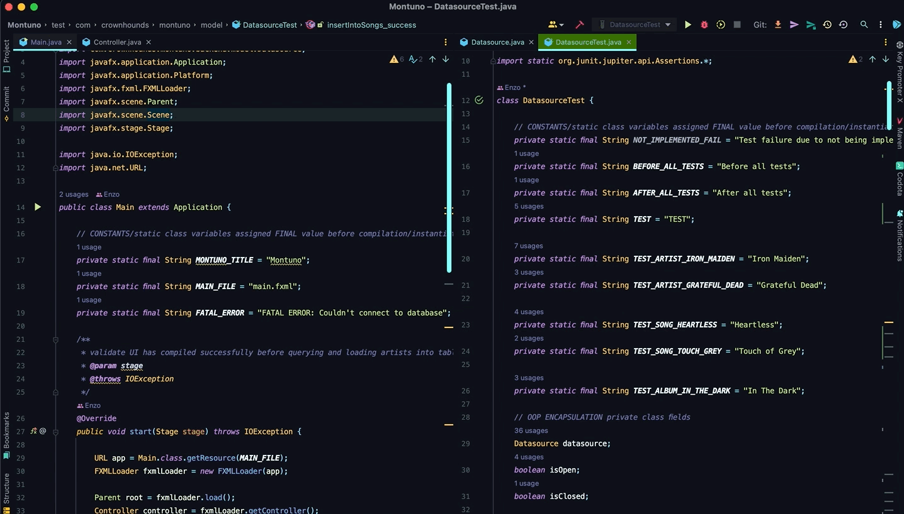
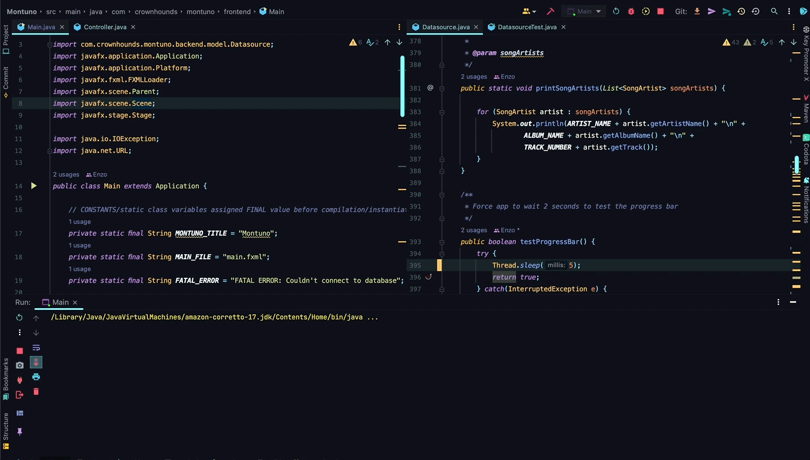

# PR Code Change Description:

### frontend
1. wrote controller that uses FXML to interface with JavaFX

### backend
1. wrote classes for database objects
2. wrote methods in Datasource that manages SQL queries & DB connection

# Functional Impacts:
manage a small database of artists and their albums & songs

# QA Reminders:
run createArtistView before tests are run

use DB Browser for SQLite app for database viewing

# Acceptance Criteria:
write an MVP that can get data from a SQLite3 DB and update the frontend & backend

### story reference:
n/a

# Build Tests:

### java Junit5

### jest
n/a

### angular
n/a

# Before:
n/a

# After:

