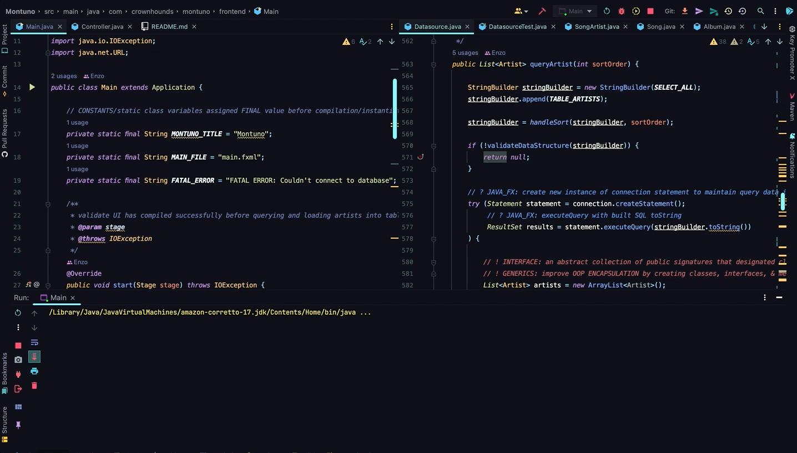
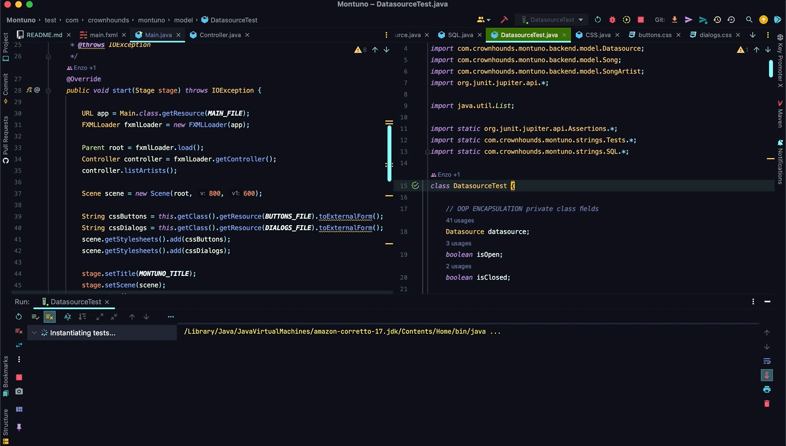
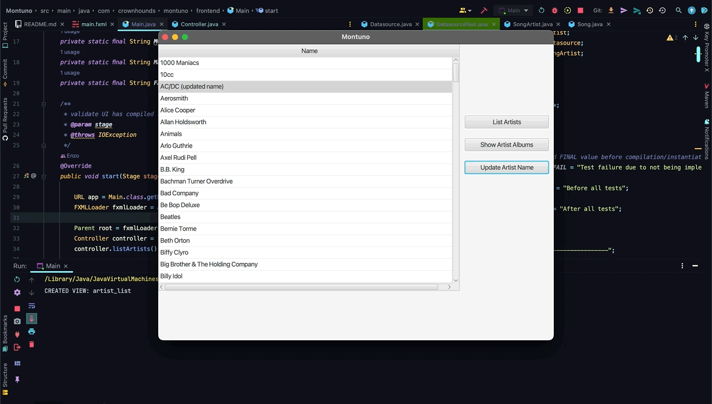

# PR Code Change Description:

### frontend
1. centralized all constant strings into strings package and created respective classes for individual string references

### backend
1. centralized all constant strings into strings package and created respective classes for individual string references

# Functional Impacts:
1. code readability & scalability improved 

# QA Reminders:
1. In strings.SQL file, the variable CONNECTION_PATH must match your local directory path to the music.db file
2. run DatasourceTest first before launching app 
3. run Main.main() to launch application 
4. use DB Browser for SQLite app for database viewing 
5. there is a music_original.db backup file in resources dir if music.db is corrupted via testing 

FUTURE STORY: currently, app manually creates an Album for UI because return src model is automatically Artist object and when cast as model is mapped incorrectly to a compatible target dataType

FUTURE STORY: currently, app requires user to manually change strings.SQL CONNECTION_PATH to match local directory path

# Acceptance Criteria:
1. write an MVP that can get data from a SQLite3 DB and update the frontend & backend
2. the MVP app manages a small database of artists and their respective albums & songs
3. run tests first: music.db file should start without an artist_list view prior to DatasourceTest execution

### story reference:
https://github.com/enzo-dante/Montuno

# Build Tests:

### java Junit5

### jest
n/a

### angular
n/a

# Before:

# After:

