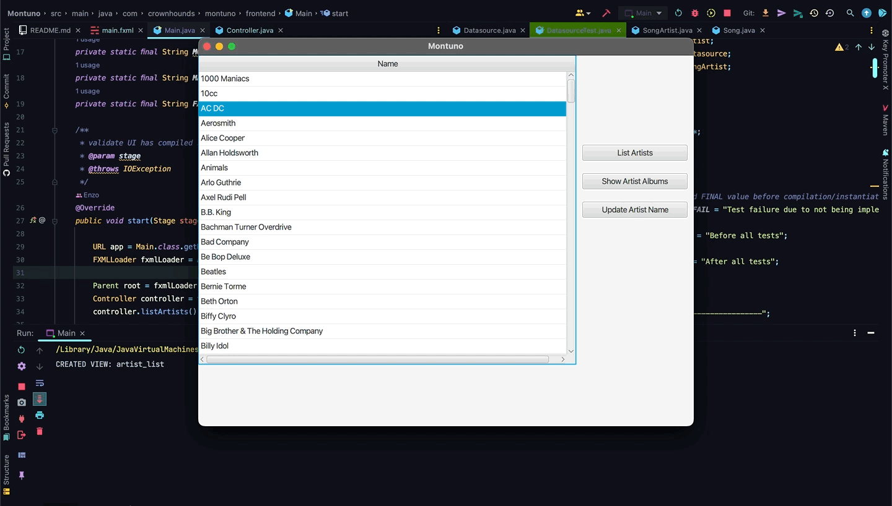

# PR Code Change Description:

### frontend
1. wrote controller that uses FXML to interface with JavaFX via main.fxml file
2. manage SQLite3 database via SQL
3. current UI functionality: GET, UPDATE 

### backend
1. added logic & tests to backend deleteSong() 
2. saved all String instances in Datasource to a respective CONSTANT
3. saved artist_list column indices as CONSTANTS
4. created & separated logic & tests for SQL statements: QUERY_ARTIST_LIST_VIEW and QUERY_ARTIST_LIST_VIEW_BY_TITLE
5. added deleteSong() to insertIntoSongs_success test to preserve music.db file
6. updated getCount_success test to account for deleteSong() after insertIntoSongs_success test

# Functional Impacts:
1. can deleteSong() by SongArtist song_id from database after validating data first from artist_list view

# QA Reminders:
1. run DatasourceTest.java before starting application to create artist_list view
2. use DB Browser for SQLite app for database viewing
3. there is a music_original.db backup file in resources dir if music.db is corrupted via testing 

### Pre-existing Bug
1. clicking updateArtist button on "AC DC", viewing their albums,
2. then returning to list view will cause "AC/DC (updated name)" to disappear 

# Acceptance Criteria:
1. write an MVP that can get data from a SQLite3 DB and update the frontend & backend
2. the MVP app manages a small database of artists and their albums & songs
3. music.db file should start without an artist_list view prior to DatasourceTest execution
4. after DatasourceTest execution, artist_list view created, all but 2 tests pass, and app starts successfully

### story reference:
https://github.com/enzo-dante/Montuno

# Build Tests:

### java Junit5

### jest
n/a

### angular
n/a

# Before:

# After:

